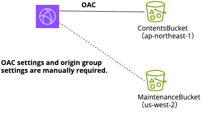

# Welcome to Your CDK TypeScript Project

Web can create a environment for the origin group with CDK.

static_main-stack.ts:
- Create an Amazon S3 bucket (ap-notrheast-1) and Amazon CloudFront distribution.
- CloudFront uses the S3 bucket as an origin and sets up origin access control.
- The S3 bucket is where the website content is deployed and delivered via the CloudFront distribution.

static_maintenance-stack.ts:
- Create an Amazon S3 bucket (us-west-2) for the maintenance page.
- This bucket will be used to host static content for maintenance pages.
- No CloudFront distribution will be created.



## Deployment Instructions

- Install Node.js using nvm:
  ```
  nvm install node
  nvm use node
  ```
- Deploy the static site stack:
  ```
  cdk deploy StaticSiteStack
  ```
- Deploy the maintenance site stack:
  ```
  cdk deploy MaintenanceStack
  ```
- Configure OAC settings and origin group settings manually: